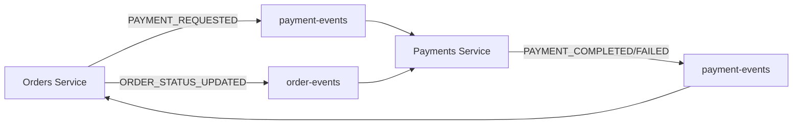

# Kafka実装調査レポート：循環参照分析

## 📋 調査概要

本レポートは、マイクロサービスアーキテクチャにおけるKafka実装の調査結果をまとめたものです。特に、サービス間のイベント駆動通信において循環参照の有無を重点的に分析しています。

**調査日時:** 2025-07-23  
**対象プロジェクト:** cloud-shop-microservices  
**調査範囲:** orders, payments, message サービスのKafka実装

---

## 🔍 実装現状

### Kafkaを使用しているサービス

| サービス | プロデューサー | コンシューマー | 主な責務 |
|---------|---------------|---------------|----------|
| **Orders** | ✅ | ✅ | 注文管理、イベント調整 |
| **Payments** | ✅ | ✅ | 支払い処理、自動返金 |
| **Message** | ❌ | ✅ | 通知送信（Email/SMS） |

### 使用トピック一覧

| トピック名 | 発行者 | 消費者 | 用途 |
|-----------|--------|--------|------|
| `order-events` | Orders, Payments | Payments | 注文ライフサイクル管理 |
| `payment-events` | Orders, Payments | Orders | 支払い状態管理 |
| `refund-events` | Payments | - | 返金処理 |
| `inventory-events` | Orders | Orders | 在庫管理連携 |
| `shipping-events` | (外部) | Orders | 配送状態管理 |
| `send-communication` | (外部) | Message | 通知送信 |

---

## ⚠️ 循環参照分析結果

### 🔴 **CRITICAL: 直接循環参照を発見**

#### パターン1: Orders ⇄ Payments Service


**問題箇所:**
1. **Orders Service** (`services/orders/src/services/ordersService.js:118`)
   ```javascript
   await this.kafkaProducer.publishOrderEvent('ORDER_STATUS_UPDATED', order);
   ```

2. **Payments Service** (`services/payments/src/kafka/paymentEventConsumer.js:102-107`)
   ```javascript
   await this.paymentsService.refundPayment(
     payment.id,
     refundableAmount,
     'Order cancellation - automatic refund'
   );
   ```

**リスク度:** 🔴 **HIGH** - 無限ループ発生の可能性

---

## 📊 詳細フロー分析

### Orders Service

#### 発行イベント
| イベントタイプ | トピック | トリガー | 影響範囲 |
|---------------|----------|----------|----------|
| `ORDER_CREATED` | order-events | 注文作成時 | Payments Service |
| `ORDER_STATUS_UPDATED` | order-events | ステータス変更時 | Payments Service |
| `ORDER_CANCELLED` | order-events | 注文キャンセル時 | Payments Service |
| `PAYMENT_REQUESTED` | payment-events | 支払い要求時 | 自サービス |
| `INVENTORY_RESERVE_REQUESTED` | inventory-events | 在庫予約時 | Inventory Service (未実装) |

#### 消費イベント
| イベントタイプ | トピック | アクション | 副作用 |
|---------------|----------|------------|--------|
| `PAYMENT_COMPLETED` | payment-events | ステータス→CONFIRMED | ORDER_STATUS_UPDATED発行 |
| `PAYMENT_FAILED` | payment-events | ステータス→CANCELLED | ORDER_STATUS_UPDATED発行 |
| `INVENTORY_RESERVED` | inventory-events | ステータス→PROCESSING | ORDER_STATUS_UPDATED発行 |
| `INVENTORY_INSUFFICIENT` | inventory-events | ステータス→CANCELLED | ORDER_STATUS_UPDATED発行 |

### Payments Service

#### 発行イベント
| イベントタイプ | トピック | トリガー | 影響範囲 |
|---------------|----------|----------|----------|
| `PAYMENT_COMPLETED` | payment-events | 支払い成功時 | Orders Service |
| `PAYMENT_FAILED` | payment-events | 支払い失敗時 | Orders Service |
| `REFUND_COMPLETED` | refund-events | 返金完了時 | - |
| `REFUND_FAILED` | refund-events | 返金失敗時 | - |

#### 消費イベント
| イベントタイプ | トピック | アクション | 副作用 |
|---------------|----------|------------|--------|
| `ORDER_CREATED` | order-events | ログ出力のみ | なし |
| `ORDER_CANCELLED` | order-events | 自動返金処理 | REFUND_COMPLETED発行 |

### Message Service

#### 消費専用サービス
| イベントタイプ | トピック | アクション |
|---------------|----------|------------|
| アカウント通信 | send-communication | Email/SMS送信 |

---

## ✅ 修正済み問題

### 1. イベントループリスク - **解決済み**
**修正前:** `services/orders/src/kafka/orderEventConsumer.js:77-78`
```javascript
await this.ordersService.updateOrderStatus(orderId, 'CONFIRMED');
// ↓ updateOrderStatusの内部でORDER_STATUS_UPDATEDイベントを発行
```

**修正後:**
```javascript
await this.ordersService.updateOrderStatus(orderId, 'CONFIRMED', null, { fromKafkaEvent: true });
// ↓ fromKafkaEvent: trueにより、イベント発行をスキップ
```

**解決策:** Kafkaイベントからの呼び出し時はイベント発行をスキップする`fromKafkaEvent`フラグを導入

### 2. 自動返金による循環 - **軽減済み**
**修正場所:** `services/payments/src/kafka/paymentEventConsumer.js:63-81`

**解決策:** 自分自身が発行したイベントを無視する仕組みを導入
```javascript
if (eventData.publishedBy === 'payments-service') {
  logger.info(`Ignoring self-published order event: ${eventType}`, { orderId });
  return;
}
```

### 3. サービス境界の曖昧化 - **改善済み**
**修正場所:** `services/payments/src/kafka/kafkaProducer.js:96-138`

**解決策:** 
- DEPRECATED警告を追加
- 発行元を明記する`publishedBy`フィールドを追加
- 将来的な削除を予定として明示

### 4. 新規追加: イベント重複処理防止機能
**実装場所:** `shared/utils/eventIdempotency.js`

**機能:**
- 同一イベントの重複処理を防止
- NodeCacheベースのメモリキャッシュ
- 各サービスで自動的に重複チェック実行

---

## 🔧 推奨対策

### 即座に対応すべき項目

#### 1. イベント重複処理防止
```javascript
// 推奨実装例
async updateOrderStatus(orderId, newStatus, eventContext = {}) {
  const order = await this.getOrder(orderId);
  
  // 同一ステータスの場合はイベント発行を抑制
  if (order.status === newStatus) {
    return order;
  }
  
  // イベント発行元を記録してループを防止
  if (eventContext.source !== 'KAFKA_EVENT') {
    await this.kafkaProducer.publishOrderEvent('ORDER_STATUS_UPDATED', {
      ...order,
      status: newStatus
    });
  }
  
  return updatedOrder;
}
```

#### 2. イベント処理のIdempotency確保
```javascript
// メッセージ重複処理防止
const processedEvents = new Set();

async handleEvent(topic, eventData) {
  const eventId = `${eventData.orderId}-${eventData.eventType}-${eventData.timestamp}`;
  
  if (processedEvents.has(eventId)) {
    logger.warn(`Duplicate event ignored: ${eventId}`);
    return;
  }
  
  processedEvents.add(eventId);
  // 処理実行...
}
```

#### 3. Circuit Breaker実装
```javascript
const CircuitBreaker = require('opossum');

const eventProcessingBreaker = new CircuitBreaker(processEvent, {
  timeout: 3000,
  errorThresholdPercentage: 50,
  resetTimeout: 30000
});
```

### 中長期的な改善案

#### 1. Event Sourcing パターンの採用
- 各サービスが自身の状態変更のみをイベントとして発行
- 他サービスの状態に直接影響を与えない設計

#### 2. Saga パターンの実装
- 長時間実行される分散トランザクションの管理
- 各ステップでの補償アクション定義

#### 3. Event Schema Registry導入
- イベントスキーマの中央管理
- バージョン管理と後方互換性の確保

---

## 📈 監視・観測性の強化

### 推奨メトリクス

| メトリクス | 目的 | 閾値目安 |
|-----------|------|----------|
| Event Processing Time | イベント処理遅延の監視 | < 1000ms |
| Event Loop Detection | 循環参照の早期検出 | 同一イベント10回以上 |
| Dead Letter Queue Size | 処理失敗イベントの監視 | < 100件 |
| Consumer Lag | コンシューマーの遅延監視 | < 1000件 |

### ログ強化案
```javascript
logger.info('Event processing', {
  eventId: eventData.id,
  eventType: eventData.eventType,
  source: eventData.source,
  processingChain: eventData.processingChain || [],
  timestamp: new Date().toISOString()
});
```

---

## 🎯 まとめと次のアクション

### 現状評価
- ✅ Kafkaの基本実装は適切
- ⚠️ 循環参照リスクが存在
- ❌ イベント重複処理防止が不十分

### 優先度別対応計画

#### P0 (緊急)
- [ ] Orders-Payments間の循環参照修正
- [ ] イベント重複処理防止機能の実装

#### P1 (高)
- [ ] Circuit Breaker実装
- [ ] Dead Letter Queue設定
- [ ] 監視メトリクス追加

#### P2 (中)
- [ ] Event Schema Registry導入検討
- [ ] Saga パターン実装検討
- [ ] パフォーマンステスト実施

### 技術的負債
現在のKafka実装には循環参照という重要な問題が存在するため、早急な対処が必要です。特にOrders ServiceとPayments Service間の相互依存関係の見直しが優先課題となります。

---

**📝 注意事項:**  
本レポートは2025-07-23時点での実装を基に作成されています。実装変更時は本分析結果の再評価が必要です。