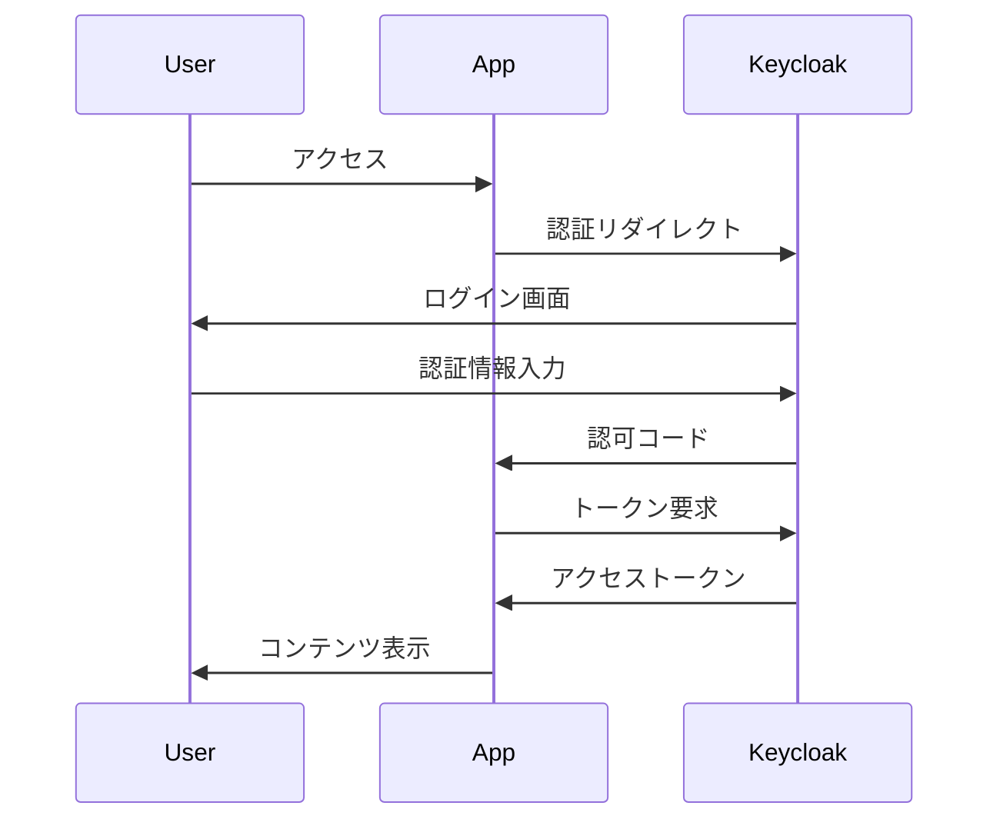

# Keycloak 使い方ガイド

## 目次

1. [Keycloakとは](#1-keycloakとは)
2. [基本概念](#2-基本概念)
3. [管理コンソールの使い方](#3-管理コンソールの使い方)
4. [ユーザー管理](#4-ユーザー管理)
5. [クライアント管理](#5-クライアント管理)
6. [認証フロー](#6-認証フロー)
7. [API連携](#7-api連携)
8. [トラブルシューティング](#8-トラブルシューティング)
9. [ベストプラクティス](#9-ベストプラクティス)

## 1. Keycloakとは

KeycloakはRed Hatが開発したオープンソースの認証・認可管理システムです。主な特徴：

- **シングルサインオン (SSO)**: 一度のログインで複数のアプリケーションにアクセス
- **OAuth 2.0/OpenID Connect**: 標準プロトコルのサポート
- **ソーシャルログイン**: Google、Facebook、GitHubなどとの連携
- **多要素認証 (MFA)**: セキュリティの強化
- **LDAP/Active Directory連携**: 既存の認証システムとの統合

## 2. 基本概念

### 2.1 Realm（レルム）

レルムは独立した名前空間で、ユーザー、クライアント、ロールなどを管理する単位です。

```
Master Realm（マスターレルム）
├── 管理者用レルム
└── Keycloak自体の管理

Application Realm（アプリケーションレルム）
├── ユーザー管理
├── クライアント管理
└── 認証設定
```

### 2.2 Client（クライアント）

アプリケーションやサービスを表す設定単位です。

| 種類 | 説明 | 使用例 |
|------|------|--------|
| Public Client | クライアントシークレットなし | SPA、モバイルアプリ |
| Confidential Client | クライアントシークレット必須 | サーバーサイドアプリ |
| Bearer-only | トークン検証のみ | API |

### 2.3 Role（ロール）

ユーザーの権限を定義します。

- **Realm Role**: レルム全体で有効なロール
- **Client Role**: 特定のクライアントでのみ有効なロール

### 2.4 User（ユーザー）

システムにアクセスする個人を表します。

## 3. 管理コンソールの使い方

### 3.1 アクセス方法

```bash
# デフォルトURL
http://localhost:8181/admin

# ログイン情報
ユーザー名: admin
パスワード: admin123
```

### 3.2 画面構成

```
┌─────────────────────────────────────────────┐
│ ヘッダー（レルム選択、ユーザーメニュー）     │
├─────────────┬───────────────────────────────┤
│             │                               │
│ 左メニュー   │     メインコンテンツ          │
│ - Users     │                               │
│ - Clients   │                               │
│ - Roles     │                               │
│ - Groups    │                               │
│             │                               │
└─────────────┴───────────────────────────────┘
```

### 3.3 日本語化

1. 右上のユーザー名をクリック
2. 「Manage account」を選択
3. 「Localization」タブで「日本語」を選択

## 4. ユーザー管理

### 4.1 ユーザー作成

1. **左メニューから「Users」を選択**
2. **「Create new user」をクリック**
3. **必須項目を入力**：
   ```
   Username: yamada.taro
   Email: yamada.taro@example.com
   First name: 太郎
   Last name: 山田
   Email verified: ON（メール確認済み）
   ```
4. **「Create」をクリック**

### 4.2 パスワード設定

1. **作成したユーザーを選択**
2. **「Credentials」タブを開く**
3. **パスワードを設定**：
   ```
   Password: secure_password123
   Temporary: OFF（一時パスワードではない）
   ```
4. **「Set password」をクリック**

### 4.3 ロール割り当て

1. **「Role mapping」タブを開く**
2. **「Assign role」をクリック**
3. **必要なロールを選択**
4. **「Assign」をクリック**

### 4.4 ユーザー属性の追加

「Attributes」タブで追加属性を設定：

| Key | Value | 説明 |
|-----|-------|------|
| department | 営業部 | 所属部署 |
| employee_id | EMP12345 | 社員番号 |
| phone | 03-1234-5678 | 電話番号 |

### 4.5 グループ管理

```
組織構造の例：
├── 管理部門
│   ├── 経営企画部
│   └── 総務部
├── 営業部門
│   ├── 第一営業部
│   └── 第二営業部
└── 技術部門
    ├── 開発部
    └── インフラ部
```

## 5. クライアント管理

### 5.1 クライアント作成

#### Webアプリケーション用設定

```yaml
Client type: OpenID Connect
Client ID: web-app
Name: ウェブアプリケーション
Description: 社内ポータルサイト

Capability config:
  Client authentication: ON
  Authorization: OFF
  Authentication flow:
    - Standard flow: ON
    - Direct access grants: ON

Settings:
  Root URL: https://app.example.com
  Valid redirect URIs: https://app.example.com/*
  Valid post logout redirect URIs: https://app.example.com/*
  Web origins: https://app.example.com
```

#### API用設定

```yaml
Client type: OpenID Connect
Client ID: backend-api
Name: バックエンドAPI
Description: RESTful API サービス

Capability config:
  Client authentication: ON
  Authorization: ON
  Authentication flow:
    - Service accounts: ON
```

### 5.2 クライアントスコープ

カスタムスコープの作成：

1. **「Client scopes」→「Create client scope」**
2. **設定例**：
   ```
   Name: profile-extended
   Description: 拡張プロフィール情報
   Type: Default
   ```
3. **マッパーの追加**：
   - User Attribute → department
   - User Property → email
   - Group Membership → groups

### 5.3 プロトコルマッパー

JWTトークンに含める情報のカスタマイズ：

```javascript
// カスタムマッパーの例
{
  "name": "employee-info",
  "protocol": "openid-connect",
  "protocolMapper": "oidc-usermodel-attribute-mapper",
  "config": {
    "user.attribute": "employee_id",
    "claim.name": "emp_id",
    "jsonType.label": "String",
    "access.token.claim": "true"
  }
}
```

## 6. 認証フロー

### 6.1 Authorization Code Flow



### 6.2 Direct Grant (Password) Flow

```bash
# トークン取得
curl -X POST "http://localhost:8181/realms/kurobank/protocol/openid-connect/token" \
  -H "Content-Type: application/x-www-form-urlencoded" \
  -d "client_id=web-app" \
  -d "client_secret=your-secret" \
  -d "username=yamada.taro" \
  -d "password=secure_password123" \
  -d "grant_type=password"

# レスポンス例
{
  "access_token": "eyJhbGciOiJSUzI1NiIs...",
  "expires_in": 300,
  "refresh_expires_in": 1800,
  "refresh_token": "eyJhbGciOiJIUzI1NiIs...",
  "token_type": "Bearer",
  "id_token": "eyJhbGciOiJSUzI1NiIs...",
  "not-before-policy": 0,
  "session_state": "2f2b5c6e-a7b3-4321-8f67-5f9876543210",
  "scope": "openid email profile"
}
```

### 6.3 Client Credentials Flow

```bash
# サービスアカウントのトークン取得
curl -X POST "http://localhost:8181/realms/kurobank/protocol/openid-connect/token" \
  -H "Content-Type: application/x-www-form-urlencoded" \
  -d "client_id=backend-api" \
  -d "client_secret=api-secret" \
  -d "grant_type=client_credentials"
```

## 7. API連携

### 7.1 Admin REST API

#### 認証

```bash
# 管理者トークン取得
ADMIN_TOKEN=$(curl -s -X POST "http://localhost:8181/realms/master/protocol/openid-connect/token" \
  -H "Content-Type: application/x-www-form-urlencoded" \
  -d "username=admin" \
  -d "password=admin123" \
  -d "grant_type=password" \
  -d "client_id=admin-cli" | jq -r '.access_token')
```

#### ユーザー操作

```bash
# ユーザー一覧取得
curl -X GET "http://localhost:8181/admin/realms/kurobank/users" \
  -H "Authorization: Bearer $ADMIN_TOKEN" \
  -H "Content-Type: application/json"

# ユーザー作成
curl -X POST "http://localhost:8181/admin/realms/kurobank/users" \
  -H "Authorization: Bearer $ADMIN_TOKEN" \
  -H "Content-Type: application/json" \
  -d '{
    "username": "suzuki.hanako",
    "enabled": true,
    "email": "suzuki.hanako@example.com",
    "firstName": "花子",
    "lastName": "鈴木",
    "credentials": [{
      "type": "password",
      "value": "password123",
      "temporary": false
    }]
  }'

# ロール割り当て
curl -X POST "http://localhost:8181/admin/realms/kurobank/users/{userId}/role-mappings/realm" \
  -H "Authorization: Bearer $ADMIN_TOKEN" \
  -H "Content-Type: application/json" \
  -d '[
    {
      "id": "{roleId}",
      "name": "bank-customer"
    }
  ]'
```

### 7.2 Account Management API

```bash
# ユーザー自身の情報取得
curl -X GET "http://localhost:8181/realms/kurobank/account" \
  -H "Authorization: Bearer $USER_TOKEN"

# パスワード変更
curl -X POST "http://localhost:8181/realms/kurobank/account/credentials/password" \
  -H "Authorization: Bearer $USER_TOKEN" \
  -H "Content-Type: application/json" \
  -d '{
    "currentPassword": "old_password",
    "newPassword": "new_password",
    "confirmation": "new_password"
  }'
```

### 7.3 Well-known エンドポイント

```bash
# OpenID Connect Discovery
curl http://localhost:8181/realms/kurobank/.well-known/openid-configuration

# 主要なエンドポイント
{
  "issuer": "http://localhost:8181/realms/kurobank",
  "authorization_endpoint": ".../protocol/openid-connect/auth",
  "token_endpoint": ".../protocol/openid-connect/token",
  "userinfo_endpoint": ".../protocol/openid-connect/userinfo",
  "jwks_uri": ".../protocol/openid-connect/certs",
  "introspection_endpoint": ".../protocol/openid-connect/token/introspect"
}
```

## 8. トラブルシューティング

### 8.1 よくある問題と解決方法

#### ログインできない

```bash
# チェックリスト
□ ユーザー名/パスワードが正しいか
□ ユーザーが有効化されているか
□ Realmが正しいか
□ クライアントが有効化されているか

# ログ確認
docker logs keycloak | grep ERROR
```

#### トークン検証エラー

```bash
# JWTトークンのデコード（jwt.ioでも可能）
echo $TOKEN | cut -d. -f2 | base64 -d | jq

# 確認ポイント
□ exp（有効期限）が切れていないか
□ iss（発行者）が正しいか
□ aud（対象者）が正しいか
```

#### CORS エラー

```javascript
// Keycloakクライアント設定
Web Origins: 
- http://localhost:3000
- https://app.example.com

// またはワイルドカード（開発環境のみ）
Web Origins: *
```

### 8.2 デバッグモード

```yaml
# docker-compose.yml
environment:
  KC_LOG_LEVEL: debug
  KC_LOG_CONSOLE_COLOR: true
```

### 8.3 パフォーマンス問題

```bash
# JVMメモリ設定
JAVA_OPTS_APPEND: "-Xms1024m -Xmx2048m"

# データベース接続プール
KC_DB_POOL_INITIAL_SIZE: 10
KC_DB_POOL_MIN_SIZE: 10
KC_DB_POOL_MAX_SIZE: 100
```

## 9. ベストプラクティス

### 9.1 セキュリティ

#### パスワードポリシー

```
Realm Settings → Authentication → Password Policy:
- Minimum length: 12
- Digits: 2
- Uppercase Characters: 2
- Lowercase Characters: 2
- Special Characters: 2
- Not Username
- Not Email
- Password History: 3
```

#### ブルートフォース対策

```
Realm Settings → Security Defenses:
- Brute Force Detection: ON
- Max Login Failures: 5
- Wait Increment: 1 minute
- Max Wait: 15 minutes
```

### 9.2 運用

#### バックアップ

```bash
# Realmエクスポート
docker exec keycloak /opt/keycloak/bin/kc.sh export \
  --file /tmp/realm-export.json \
  --realm kurobank

# データベースバックアップ
pg_dump -h localhost -U keycloak keycloak > keycloak_backup.sql
```

#### 監視

```yaml
# Prometheusメトリクス有効化
KC_METRICS_ENABLED: true

# ヘルスチェックエンドポイント
- /health/ready
- /health/live
- /metrics
```

### 9.3 開発環境

#### Docker Compose設定例

```yaml
version: '3.8'

services:
  keycloak-dev:
    image: quay.io/keycloak/keycloak:23.0
    command: start-dev
    environment:
      KEYCLOAK_ADMIN: admin
      KEYCLOAK_ADMIN_PASSWORD: ${KEYCLOAK_ADMIN_PASSWORD:-admin}
      KC_DB: postgres
      KC_DB_URL_HOST: postgres
      KC_DB_URL_DATABASE: keycloak
      KC_DB_USERNAME: keycloak
      KC_DB_PASSWORD: keycloak
      KC_HOSTNAME_STRICT: false
      KC_HTTP_ENABLED: true
      KC_PROXY: edge
    ports:
      - "8080:8080"
    depends_on:
      postgres:
        condition: service_healthy
    networks:
      - keycloak-network

  postgres:
    image: postgres:15-alpine
    environment:
      POSTGRES_DB: keycloak
      POSTGRES_USER: keycloak
      POSTGRES_PASSWORD: keycloak
    volumes:
      - postgres_data:/var/lib/postgresql/data
    healthcheck:
      test: ["CMD-SHELL", "pg_isready -U keycloak"]
      interval: 10s
      timeout: 5s
      retries: 5
    networks:
      - keycloak-network

volumes:
  postgres_data:

networks:
  keycloak-network:
    driver: bridge
```

### 9.4 本番環境の考慮事項

1. **高可用性**
   - Keycloakクラスタリング
   - データベースレプリケーション
   - ロードバランサー設定

2. **セキュリティ強化**
   - HTTPS必須
   - ファイアウォール設定
   - 定期的なセキュリティアップデート

3. **パフォーマンス最適化**
   - キャッシュ設定
   - セッション管理
   - データベースインデックス

4. **監査とコンプライアンス**
   - イベントログ記録
   - アクセスログ分析
   - 定期的な権限レビュー

## まとめ

Keycloakは強力な認証・認可システムですが、適切な設定と運用が重要です。このガイドを参考に、セキュアで使いやすい認証システムを構築してください。

詳細な情報は[公式ドキュメント](https://www.keycloak.org/documentation)を参照してください。