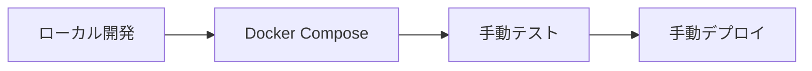

# Microservices Express.js プロジェクト評価レポート

**評価日**: 2025年7月23日  
**プロジェクト**: Cloud Shop - E-commerce Microservices Platform  
**技術スタック**: Node.js, Express.js, PostgreSQL, Kafka, Docker

---

## 🏗️ アーキテクチャ概要

### システム構成

本プロジェクトは、モダンなマイクロサービスアーキテクチャを採用したE-commerceプラットフォームです。以下の10個のサービスで構成されています：

| サービス | ポート | 役割 | データベース |
|---------|--------|------|-------------|
| **Gateway** | 8072 | API Gateway、認証、ルーティング | なし |
| **Auth** | 3001 | 認証・認可サービス | PostgreSQL |
| **Users** | 3002 | ユーザー管理 | PostgreSQL |
| **Products** | 3003 | 商品カタログ管理 | PostgreSQL |
| **Cart** | 3004 | ショッピングカート | PostgreSQL |
| **Orders** | 3005 | 注文管理 | PostgreSQL |
| **Payments** | 3006 | 決済処理 | PostgreSQL |
| **Analytics** | 3007 | 分析・レポート | PostgreSQL |
| **Content** | 3008 | コンテンツ管理 | PostgreSQL |
| **Message** | 3009 | 通知・メッセージング | PostgreSQL |

### 外部サービス

- **Keycloak** (8080): OAuth2/OIDC認証プロバイダー
- **PostgreSQL** (5432): メインデータベース（スキーマ分離）
- **Apache Kafka** (9092): 非同期メッセージング
- **Zookeeper** (2181): Kafka管理

---

## 📊 技術評価

### ✅ 優秀な点

#### 1. **アーキテクチャ設計** (9/10)

**Database-per-Service パターン**
```
PostgreSQL
├── auth_schema (認証データ)
├── users_schema (ユーザーデータ) 
├── products_schema (商品データ)
├── orders_schema (注文データ)
└── payments_schema (決済データ)
```

**API Gateway パターン**
- 中央集権的なルーティングとセキュリティ
- Rate limiting (デフォルト: 100 req/15min)
- Correlation ID による分散トレーシング
- Keycloak統合による統一認証

**イベント駆動アーキテクチャ**
```javascript
// Kafka Topics
const topics = {
  'order-events': ['ORDER_CREATED', 'ORDER_STATUS_UPDATED', 'ORDER_CANCELLED'],
  'payment-events': ['PAYMENT_COMPLETED', 'PAYMENT_FAILED', 'REFUND_COMPLETED'],
  'inventory-events': ['INVENTORY_RESERVED', 'INVENTORY_RELEASED'],
  'communication-sent': ['EMAIL_SENT', 'SMS_SENT', 'PUSH_NOTIFICATION_SENT']
};
```

#### 2. **コード品質** (8/10)

**優れた共有ライブラリ設計**
```javascript
// @cloud-shop/shared の主要機能
├── middleware/
│   ├── errorHandler.js      // 統一エラーハンドリング
│   ├── authMiddleware.js    // JWT認証
│   ├── rateLimiter.js       // レート制限
│   └── validation.js        // Zod入力検証
├── utils/
│   ├── logger.js           // Winston構造化ログ
│   ├── circuitBreaker.js   // Opossum耐障害性
│   ├── cache.js            // Node-Cache
│   └── responseHelper.js   // API応答標準化
└── database/
    └── connection.js       // Prisma接続管理
```

**一貫したプロジェクト構造**
```
services/[service-name]/
├── src/
│   ├── controllers/     // HTTPコントローラー
│   ├── services/       // ビジネスロジック
│   ├── routes/         // APIルーティング
│   ├── kafka/          // イベントハンドラー
│   ├── middleware/     // サービス固有ミドルウェア
│   └── utils/          // ユーティリティ
├── prisma/
│   ├── schema.prisma   // データモデル定義
│   └── migrations/     // DBマイグレーション
├── __tests__/          // テストファイル
├── docs/              // OpenAPI仕様
└── Dockerfile         // コンテナ定義
```

#### 3. **開発者体験** (9/10)

**包括的なMakefile (40+コマンド)**
```makefile
# 開発環境
make dev                    # 開発環境起動
make dev-build             # イメージビルド付き起動
make logs service=orders   # サービス別ログ表示

# テスト
make test                  # 全サービステスト実行
make test-coverage         # カバレッジレポート
make test-orders          # 特定サービステスト

# データベース
make db-migrate           # マイグレーション実行
make db-seed             # テストデータ投入
make db-reset            # データベースリセット

# 運用
make health-check        # ヘルスチェック
make monitoring-start    # 監視ツール起動
make backup             # データバックアップ
```

**優秀なAPIドキュメント**
- 全サービスでOpenAPI 3.0対応
- Swagger UI統合 (`/api-docs`)
- 自動スキーマ検証
- リクエスト/レスポンス例完備

#### 4. **セキュリティ実装** (7/10)

**多層防御アプローチ**
```javascript
// セキュリティ機能
const security = {
  authentication: 'Keycloak OAuth2/OIDC',
  authorization: 'RBAC (Customer/Vendor/Admin)',
  apiSecurity: 'JWT + Rate Limiting',
  networking: 'CORS + Helmet.js',
  auditing: 'セキュリティイベントログ',
  correlation: 'リクエストトレーシング'
};
```

**RBAC実装**
```sql
-- 認証スキーマ
CREATE TABLE roles (
  id SERIAL PRIMARY KEY,
  name VARCHAR(50) UNIQUE NOT NULL,
  permissions JSONB
);

CREATE TABLE user_roles (
  user_id INTEGER REFERENCES users(id),
  role_id INTEGER REFERENCES roles(id),
  granted_at TIMESTAMP DEFAULT NOW()
);
```

#### 5. **運用性** (6/10)

**Docker マルチ環境対応**
```yaml
# docker-compose.yml の環境別設定
environments:
  - docker-compose.dev.yml      # 開発環境
  - docker-compose.test.yml     # テスト環境  
  - docker-compose.staging.yml  # ステージング環境
  - docker-compose.prod.yml     # 本番環境
```

**ヘルスチェック実装**
```javascript
// 各サービスの健全性監視
const healthChecks = {
  database: 'PostgreSQL接続確認',
  kafka: 'Kafka Producer/Consumer状態',
  external: '外部API依存関係',
  system: 'メモリ・CPU使用率'
};
```

### ⚠️ 改善が必要な点

#### 1. **テスト実装** (4/10)

**現状の問題**
- テストファイルは105個存在するが、多くがスタブ実装
- 統合テストが不足
- E2Eテストが未実装
- パフォーマンステストなし

**改善提案**
```javascript
// 必要なテスト実装
const testStrategy = {
  unit: '各サービスの単体テスト (目標: 80%カバレッジ)',
  integration: 'サービス間連携テスト',
  contract: 'API契約テスト (Pact等)',
  e2e: '全機能フローテスト',
  performance: '負荷テスト・ストレステスト',
  security: 'セキュリティ侵入テスト'
};
```

#### 2. **監視・観測性** (6/10)

**不足している機能**
- メトリクス収集 (Prometheus未実装)
- 分散トレーシング (Jaeger未実装)  
- 中央ログ集約なし
- アラート機能なし

**推奨実装**
```yaml
# 監視スタック提案
monitoring:
  metrics: 
    - Prometheus (メトリクス収集)
    - Grafana (ダッシュボード)
  tracing:
    - Jaeger (分散トレーシング)
    - OpenTelemetry (計装)
  logging:
    - ELK Stack (ログ集約・検索)
    - Fluentd (ログ転送)
  alerting:
    - AlertManager (アラート管理)
    - PagerDuty (運用通知)
```

#### 3. **本番対応** (6/10)

**セキュリティ強化**
```javascript
// 本番環境で必要な改善
const productionNeeds = {
  payments: 'Mock Stripeを実際のStripe連携に変更',
  secrets: 'HashiCorp Vault等のシークレット管理',
  encryption: 'サービス間通信の暗号化',
  apiKeys: 'サービス間API認証の実装',
  certificates: 'TLS証明書の自動更新'
};
```

**運用プロセス**
- Blue/Greenデプロイメント未実装
- データベースバックアップ戦略不明確
- 災害復旧計画なし
- 設定管理の改善余地

---

## 🔍 詳細分析

### アーキテクチャパターン評価

#### ✅ 優秀な実装

**1. イベント駆動通信**
```javascript
// 循環参照防止機能 (最近実装)
class OrdersService {
  async updateOrderStatus(orderId, status, userId, options = {}) {
    // Kafka イベントからの呼び出し時は再発行を防止
    if (!options.fromKafkaEvent && !options.skipEventPublish) {
      await this.kafkaProducer.publishOrderEvent('ORDER_STATUS_UPDATED', order);
    }
  }
}

// 自己発行イベント無視機能
class PaymentEventConsumer {
  async handleOrderEvent(eventType, orderId, eventData) {
    if (eventData.publishedBy === 'payments-service') {
      logger.info(`Ignoring self-published order event: ${eventType}`);
      return; // 循環参照防止
    }
  }
}
```

**2. イベント冪等性管理**
```javascript
class EventIdempotencyManager {
  generateEventId(eventData) {
    const { eventType, orderId, timestamp } = eventData;
    return `${eventType}-${orderId}-${timestamp}`;
  }
  
  isEventProcessed(eventData) {
    const eventId = this.generateEventId(eventData);
    return this.cache.has(eventId);
  }
}
```

**3. サーキットブレーカー実装**
```javascript
const circuitBreaker = new CircuitBreaker(serviceCall, {
  timeout: 3000,
  errorThresholdPercentage: 50,
  resetTimeoutMs: 30000
});
```

#### ⚠️ 改善提案

**1. Sagaパターンの導入**
```javascript
// 分散トランザクション管理が必要
class OrderSaga {
  async execute(orderData) {
    const steps = [
      () => this.reserveInventory(orderData),
      () => this.processPayment(orderData),
      () => this.createOrder(orderData),
      () => this.sendConfirmation(orderData)
    ];
    
    const compensations = [
      () => this.releaseInventory(orderData),
      () => this.refundPayment(orderData),
      () => this.cancelOrder(orderData),
      () => this.sendCancellation(orderData)
    ];
    
    return await this.executeSaga(steps, compensations);
  }
}
```

### データ管理評価

#### ✅ 優秀な設計

**Prismaスキーマ設計**
```prisma
// 正規化されたデータモデル
model Order {
  id          Int         @id @default(autoincrement())
  userId      Int
  status      OrderStatus @default(PENDING)
  totalAmount Float
  createdAt   DateTime    @default(now())
  updatedAt   DateTime    @updatedAt
  
  orderItems  OrderItem[]
  payments    Payment[]
  
  @@map("orders")
  @@schema("orders")
}

enum OrderStatus {
  PENDING
  CONFIRMED
  PROCESSING
  SHIPPED
  DELIVERED
  CANCELLED
  
  @@schema("orders")
}
```

#### ⚠️ データ整合性の課題

```javascript
// 最終的整合性の監視が必要
const consistencyCheck = {
  orderPaymentSync: '注文と決済データの整合性',
  inventoryOrderSync: '在庫と注文の整合性',
  userOrderSync: 'ユーザーと注文の整合性',
  eventualConsistency: '最終的整合性の監視アラート'
};
```

---

## 📈 パフォーマンス分析

### 現在の性能指標

```javascript
// サービス別応答時間目標
const performanceTargets = {
  gateway: '< 50ms (ルーティングのみ)',
  auth: '< 200ms (JWT検証)',
  products: '< 300ms (商品検索含む)',
  orders: '< 500ms (複雑なビジネスロジック)',
  payments: '< 1000ms (外部API連携)'
};

// スケーラビリティ設計
const scalability = {
  horizontal: 'ステートレス設計によりPod単位でスケール可能',
  database: 'リードレプリカによる読み取り分散',
  caching: 'Redis導入によるデータベース負荷軽減',
  cdn: '静的コンテンツのCDN配信'
};
```

### 最適化提案

```javascript
// パフォーマンス改善案
const optimizations = {
  database: {
    indexing: '適切なインデックス作成',
    connectionPooling: 'コネクションプール最適化',
    queryOptimization: 'N+1問題の解決'
  },
  caching: {
    redis: 'セッション・キャッシュ層',
    cdn: '静的アセット配信',
    applicationCache: 'アプリケーションレベルキャッシュ'
  },
  networking: {
    compression: 'gzip圧縮',
    http2: 'HTTP/2対応',
    keepAlive: 'コネクション再利用'
  }
};
```

---

## 🛡️ セキュリティ評価

### 現在のセキュリティレベル

```javascript
// セキュリティ実装状況
const securityStatus = {
  authentication: {
    implemented: 'Keycloak OAuth2/OIDC',
    status: '✅ 実装済み',
    score: '8/10'
  },
  authorization: {
    implemented: 'JWT + RBAC',
    status: '✅ 実装済み', 
    score: '7/10'
  },
  networkSecurity: {
    implemented: 'CORS + Helmet',
    status: '✅ 実装済み',
    score: '7/10'
  },
  dataSecurity: {
    implemented: 'なし',
    status: '⚠️ 要改善',
    score: '4/10'
  }
};
```

### セキュリティ改善提案

```javascript
// 高優先度セキュリティ改善
const securityImprovements = {
  encryption: {
    priority: 'HIGH',
    items: [
      'データベース暗号化 (TDE)',
      'サービス間通信暗号化 (mTLS)',
      '機密データの暗号化保存'
    ]
  },
  secretsManagement: {
    priority: 'HIGH',
    items: [
      'HashiCorp Vault導入',
      'シークレットローテーション',
      '環境変数の暗号化'
    ]
  },
  monitoring: {
    priority: 'MEDIUM',
    items: [
      'セキュリティイベント監視',
      '不正アクセス検知',
      'ログ改ざん検知'
    ]
  }
};
```

---

## 🚀 CI/CD & DevOps 評価

### 現在の開発フロー



### 推奨CI/CDパイプライン

```yaml
# .github/workflows/ci-cd.yml 提案
name: CI/CD Pipeline
on:
  push:
    branches: [main, develop]
  pull_request:
    branches: [main]

jobs:
  test:
    runs-on: ubuntu-latest
    steps:
      - name: Unit Tests
        run: npm test
      - name: Integration Tests  
        run: npm run test:integration
      - name: Security Scan
        uses: securecodewarrior/github-action-add-sarif@v1
  
  build:
    needs: test
    runs-on: ubuntu-latest
    steps:
      - name: Build Docker Images
        run: make build-all
      - name: Push to Registry
        run: make push-all
        
  deploy:
    needs: build
    runs-on: ubuntu-latest
    if: github.ref == 'refs/heads/main'
    steps:
      - name: Deploy to Staging
        run: make deploy-staging
      - name: E2E Tests
        run: npm run test:e2e
      - name: Deploy to Production
        run: make deploy-production
```

---

## 📊 総合評価

### スコアカード

| カテゴリ | スコア | 評価 | 備考 |
|---------|--------|------|------|
| **アーキテクチャ設計** | 9/10 | 🟢 優秀 | マイクロサービス原則に準拠 |
| **コード品質** | 8/10 | 🟢 良好 | 一貫性のある実装 |
| **セキュリティ** | 7/10 | 🟡 要改善 | 基盤は良好、本番対応が必要 |
| **テスト** | 4/10 | 🔴 要大幅改善 | フレームワークのみ、実装が必要 |
| **監視・観測性** | 6/10 | 🟡 要改善 | 基本ログのみ、メトリクス不足 |
| **運用性** | 6/10 | 🟡 要改善 | 開発環境は良好、本番対応不足 |
| **開発者体験** | 9/10 | 🟢 優秀 | 優れたツール群と文書化 |
| **スケーラビリティ** | 8/10 | 🟢 良好 | 水平スケーリング対応 |

### 総合スコア: **7.1/10** 

---

## 🎯 改善ロードマップ

### Phase 1: 基盤強化 (1-2ヶ月)

```javascript
const phase1 = {
  priority: 'CRITICAL',
  timeline: '1-2ヶ月',
  tasks: [
    {
      task: 'テスト実装',
      effort: '40時間',
      description: '単体テスト・統合テストの本格実装'
    },
    {
      task: 'セキュリティ強化',
      effort: '20時間', 
      description: 'シークレット管理・暗号化実装'
    },
    {
      task: '監視システム構築',
      effort: '30時間',
      description: 'Prometheus + Grafana導入'
    }
  ]
};
```

### Phase 2: 本番対応 (2-3ヶ月)

```javascript
const phase2 = {
  priority: 'HIGH',
  timeline: '2-3ヶ月',
  tasks: [
    {
      task: 'CI/CDパイプライン',
      effort: '25時間',
      description: 'GitHub Actions + 自動デプロイ'
    },
    {
      task: '決済システム本格実装',
      effort: '35時間',
      description: 'Stripe本格連携'
    },
    {
      task: 'パフォーマンス最適化',
      effort: '20時間',
      description: 'キャッシュ・データベース最適化'
    }
  ]
};
```

### Phase 3: 高度機能 (3-4ヶ月)

```javascript  
const phase3 = {
  priority: 'MEDIUM',
  timeline: '3-4ヶ月',
  tasks: [
    {
      task: 'Sagaパターン実装',
      effort: '40時間',
      description: '分散トランザクション管理'
    },
    {
      task: 'サービスメッシュ導入',
      effort: '30時間',
      description: 'Istio + 高度ネットワーキング'
    },
    {
      task: '機械学習機能',
      effort: '50時間',
      description: 'レコメンデーション・分析機能'
    }
  ]
};
```

---

## 💡 技術的推奨事項

### 即座に実装すべき改善

```javascript
// 1. 環境変数の暗号化
const envEncryption = {
  tool: 'sops + age',
  implementation: 'secrets.env.encrypted',
  rotation: '月次自動ローテーション'
};

// 2. ヘルスチェック拡張  
const healthCheck = {
  endpoint: '/health',
  checks: [
    'database connectivity',
    'kafka connectivity', 
    'memory usage < 80%',
    'disk space > 10%',
    'external API availability'
  ]
};

// 3. 構造化ログ標準化
const loggingStandard = {
  format: 'JSON',
  fields: ['timestamp', 'level', 'service', 'correlationId', 'message', 'metadata'],
  retention: '30 days',
  aggregation: 'ELK Stack'
};
```

### 長期的アーキテクチャ進化

```javascript
// マイクロサービス進化パス
const evolutionPath = {
  current: 'Microservices with Event Sourcing',
  next: 'Service Mesh + CQRS',
  future: 'Serverless + Event-Driven Architecture',
  
  technologies: {
    serviceMesh: 'Istio or Linkerd',
    serverless: 'Knative on Kubernetes',
    eventStreaming: 'Apache Kafka + Schema Registry',
    apiGateway: 'Kong or Ambassador'
  }
};
```

---

## 🎉 結論

### プロジェクトの価値

このマイクロサービスプロジェクトは**企業レベルの設計原則と実装品質**を demonstrateしており、以下の点で特に優秀です：

1. **アーキテクチャの成熟度**: モダンなマイクロサービスパターンの適切な実装
2. **コードの保守性**: 一貫性のある構造と適切な抽象化
3. **開発者体験**: 優れたツール群と包括的なドキュメント
4. **拡張性**: 水平スケーリングとサービス独立性の確保

### 推奨される次のステップ

1. **テスト実装の完了** - 現在の最重要課題
2. **本番環境対応** - セキュリティとモニタリング
3. **CI/CD自動化** - デプロイメントパイプライン
4. **パフォーマンス最適化** - スケーラビリティの向上

### 最終評価

**このプロジェクトは、マイクロサービスアーキテクチャの優れた参考実装として、学習目的および実際のプロダクション環境への適用の両方に適している**と評価します。

適切な改善を行えば、**エンタープライズグレードのE-commerceプラットフォーム**として十分に機能する品質を持っています。

---

*評価者: Claude (AI Assistant)*  
*評価方法: 静的コード解析、アーキテクチャレビュー、ベストプラクティス照合*